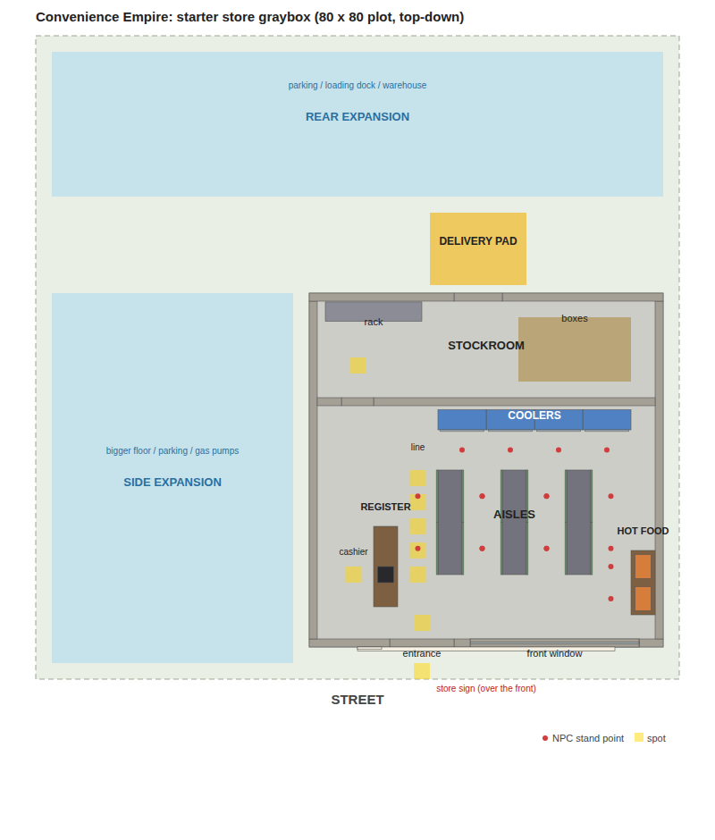

# Convenience Empire

Roblox game: start by working the register at one tiny corner store and grow it into a worldwide brand. Built on the TCG shop game's city map (up to 6 players, one plot each).

## What's here

| Path | What it is | Where it goes in Studio |
| --- | --- | --- |
| `KICKOFF_PROMPT.md` | Design and build plan for the first Studio session | Paste into the Claude session on the laptop |
| `studio/BuildStoreTemplate.luau` | Graybox builder for the starter store | Paste into the Command Bar (instructions at the top of the file) |
| `src/shared/Config.luau` | Balance numbers: clock, hours, customers, staff | ModuleScript `Config` in ReplicatedStorage |
| `src/shared/ProductCatalog.luau` | The 10 starter products | ModuleScript `ProductCatalog` in ReplicatedStorage |
| `docs/store-layout.png` | Top-down view of what the builder makes | |
| `tests/` | Checks that run outside Roblox | |



## Notes for whoever builds next

- **Look up tags inside a store model.** The template in ServerStorage carries the same tags as the live stores, so `CollectionService:GetTagged("Shelf")` also returns the template's shelves. Always search inside one store model.
- **Slots start empty.** Shelf and cooler slots have `ProductId = ""`. The first product the player stocks claims the slot, so the layout they pick becomes their blueprint. The two hot food stations are fixed: `CoffeeStation` is coffee, `RollerGrill` is hot dogs.
- **Every slot has a `StandPoint` attachment** where an NPC stands to use it. Queue spots, the cashier spot, the staff spawn and the customer spawn are tagged marker parts.
- **`CustomerSpawn` is a placeholder.** Move it to wherever the TCG game's customers come in from the street.
- **Graybox settings:** markers are half transparent and the roof is see-through (0.6). Hide everything tagged `Marker` at runtime, and set the roof to 0 once we're past graybox.
- **Plot fit:** the store needs about 48 x 60 studs including the sidewalk and delivery pad. On smaller plots the builder warns and skips any expansion zone that doesn't fit.

## Running the checks

Needs the Luau CLI (`luau` and `luau-analyze`) from https://github.com/luau-lang/luau/releases on your PATH.

```sh
convenience-empire/tests/run.sh
```

It type-checks the shared modules, sanity-checks the catalog and config, then runs the store builder against a fake Roblox API. That confirms nothing overlaps, everything fits on the plot, and NPCs can reach every spot: customers only through the front door, staff from the stockroom, deliveries through the back door.
